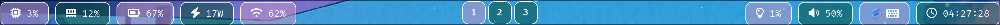

# Mini Waybar Config



## About

A  small waybar configuration for my personal use.  
It's simple, few-dependencies, clean.

Some of configuration code blocks are copied from waybar's official wiki.

## Use

Make sure you have dependencies:

- Font Awesome 7 Free
- FiraCode Nerd Font
- Python3 and python module "psutil"

> For Arch Linux user:

```
sudo pacman -S otf-font-awesome ttf-firacode-nerd python3 python-psutil
```

Clone the repo to ~/.config/waybar. (Please make sure you backed up
your existing configurations.)  

```
git clone https://github.com/Rea1Atomic/mini-waybar-config.git ~/.config/waybar
```

Then restart waybar.

```
pkill waybar
waybar
```

#### Some parts you may want to modify

- Colors: In style.css `@define-color` part.
- Backlight device: In config.jsonc `"device":`. Default is Intel.
- Battery path: In scripts/energy-rate

## Preview


